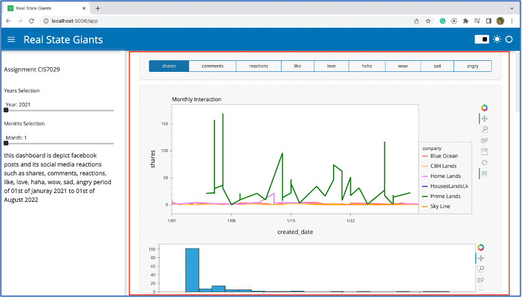
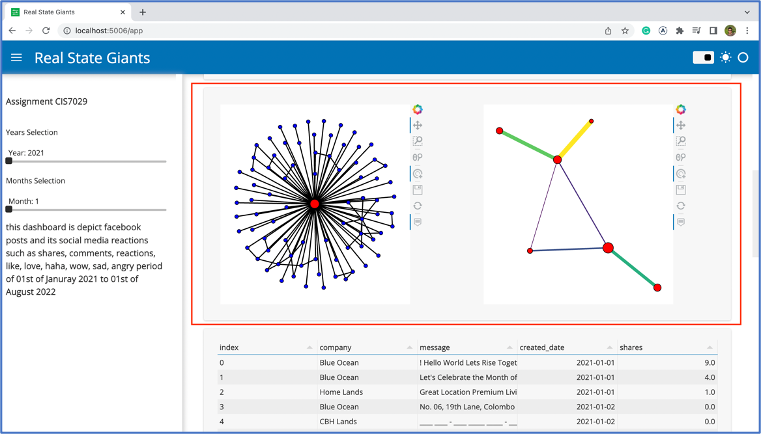
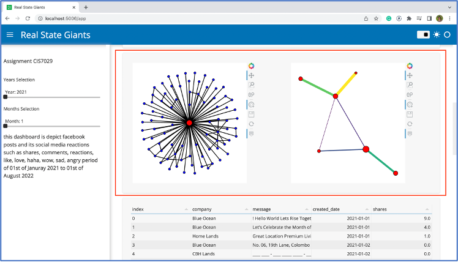
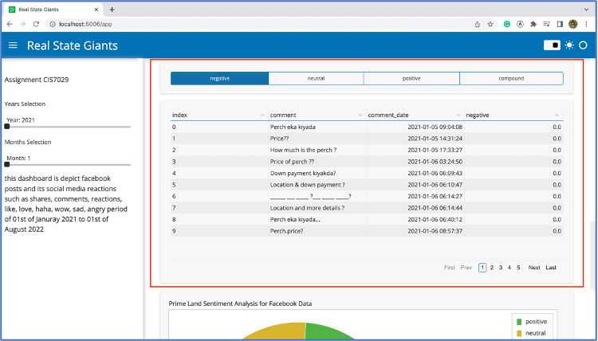
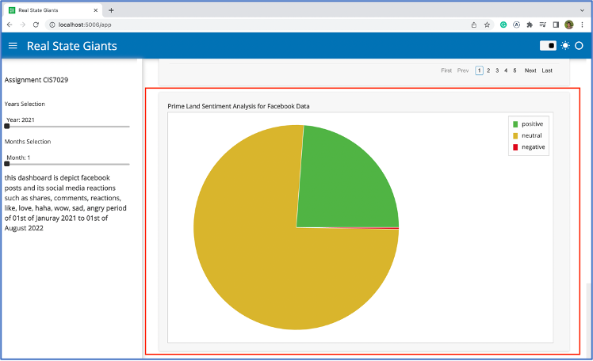

Social Media Analytics for Business

Real Estate industry is another essential area need to improve along with the population growth. As for living standards getting improve, this area needs to improve parallelly. I’d like to select Prime Group as for the company. When considering property market Prime Group is one of major player. But with the present market status, it’s been a challenge for this property developer to maintain their products such as lands, houses, apartments, housing schemes and commercial buildings. There are few large and small competitors for Prime Group presently, such as, Home Lands, Blue Ocean, CBH Lands, Sky Line and HouseAndLandsLk companies.

Based on following Real State Companies in Sri Lanka against Revenue and Employees table, it is showing other major players and their revenues in this business.

We can see Prime Lands is on 7th position, making 28.2 million USD in the year of 2021. when this amount converts into Sri Lankan Rupees its around 980-1000 million, that amount tally in their following Management Discussion & Analysis report for 2020/2021. (Prime Lands (Pvt) Ltd, 2021)

Welcome to the exciting project that aimed to revolutionize the way I interacted with social media data for few selected companies. In response to the evolving landscape of digital communication, I was assigned to create a comprehensive dashboard that visualized crucial social media information. This dashboard was intended to empower our company to gain deeper insights into user engagement, information diffusion, keywords, and sentiment analysis across various social media platforms.

Project Objective:

My primary goal was to develop a dynamic and user-friendly dashboard capable of extracting, processing, and presenting social media data in a meaningful way. I had identified the following key features to be integrated into the dashboard:

1. Social Media Data Extraction: My dashboard offered a robust data extraction method that could pull data from both simplex (single) and multiplex (multiple) social media platforms. While my focus was on real-time streaming data, I also supported static data extraction for comprehensive coverage.

2. User Engagement Visualization: To understand the dynamics of each post, I visualized user engagement metrics such as the number of likes, dislikes, and other relevant interactions. This provided valuable insights into the impact and reach of each post.

3. Information Diffusion Graph: My dashboard employed network visualization techniques to illustrate the diffusion of information among peer networks. Users were able to explore the flow of information from one user to another, creating a clear picture of how posts propagated across the social media landscape.

4. Keyword and Behavior Analysis: I extracted and analyzed hashtags and keywords associated with each post, shedding light on the trending topics and behaviors driving user engagement. This enabled our company to align its content strategy with current trends.

5. Sentiment Analysis: My dashboard employed natural language processing (NLP) techniques to analyze comments related to each post. By assessing the polarity of these comments, I could gauge public sentiment, allowing our company to make data-driven decisions in response to user feedback.

6. Additional Features: While the above features formed the core of my dashboard, I encouraged innovation and welcomed the addition of more features that could enhance the utility and effectiveness of our tool.

Project Scope and Approach:

This project required a multidisciplinary approach, combining my expertise in data extraction, data processing, visualization, and NLP. I leveraged cutting-edge technologies and methodologies to ensure the accuracy, real-time capabilities, and scalability of our dashboard.

Project Deliverables:

At the end of this project, I delivered a fully functional social media dashboard that met the specified requirements. This dashboard empowered our company to make informed decisions, enhance engagement with our audience, and stay ahead in the ever-evolving social media landscape.

